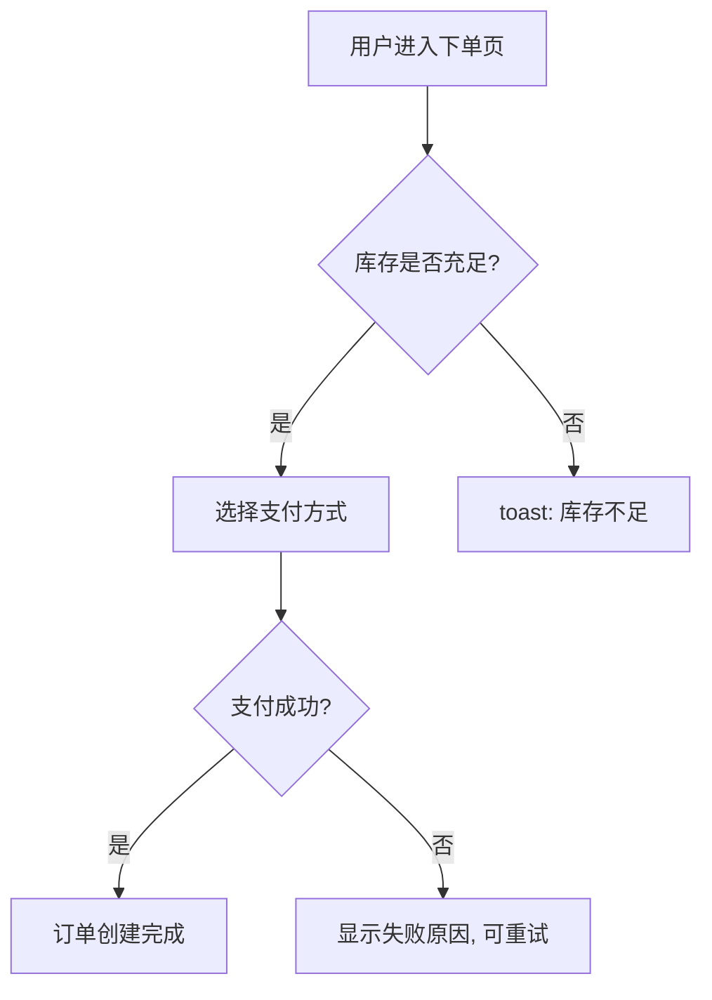
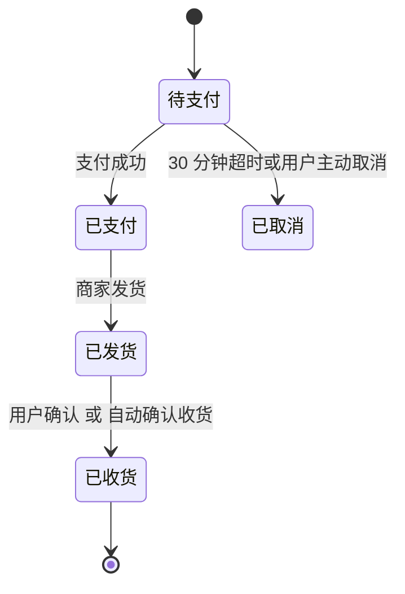
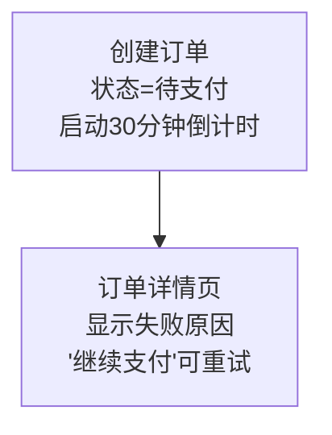
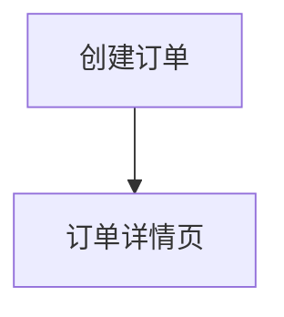

# PRD Writer

通过对话方式帮用户生成和迭代产品需求文档。文档以 markdown 文件保存,聚焦**功能需求**和**交互流程**。

核心是两件事:**不懂就问,带选项追问**;**冲突要停下来,引用原文让用户决定**。

## 工作流概览

每次被触发时按以下顺序处理:

1. **先读已有 PRD**(如果有) → 2. **理解用户这次说了什么** → 3. **找出不明确/冲突的点,带选项追问** → 4. **所有点都问清楚后,写或更新文档** → 5. **告诉用户文档保存在哪、改了哪些部分**

千万不要跳过第 3 步直接写文档 —— 用户给的需求几乎一定有模糊地带,**模糊处脑补写出来的内容比"承认不懂"更糟糕**,因为下游开发会按你写的去做。

## 0. 先判断这次请求该不该由 prd-writer 处理

skill description 已经划了"不适用"的边界,但万一被错误触发(或请求里既有 PRD 编写也有别的事),**第一件事先确认这次确实是 PRD 编写**。

如果用户实际是想 **翻译 PRD / 评审/挑错 PRD / 拆任务 / 写代码 / 整理会议纪要 / 整理文件 / 组件迁移**,**主动告诉用户**:"看起来你说的是 X,但 prd-writer 主要做'写 PRD 内容本身',这事更适合 [对应工具/直接对话/对应 skill]。你确实是想写 PRD 吗?" —— 等用户回答再决定继续不继续。**不要硬上**;边缘情况下硬生成内容只会让用户更不满。

如果请求**混合了 PRD 编写和其他事**(如"加这个功能到 PRD,然后帮我拆开发任务"),按顺序做完 PRD 那部分,然后明确告诉用户:"PRD 写完了,'拆任务'这部分我接着做还是另开?"

## 1. 启动时先读已有 PRD

被触发后,先用 Glob 或 ls 看当前工作目录有没有 `PRD-*.md` 文件:

- **0 个** → 首次创建场景,在第一轮追问里把"产品名"问清楚
- **1 个** → Read 一遍,理解已有的产品定位、功能列表、编号到了哪一个(下一个新功能用 `F00X+1`)、各功能的关键约束
- **2 个及以上** → **不要自己猜用户在哪一份上操作**。第一件事就是问:"我在目录里看到几份 PRD([列出文件名]),你这次是想在哪一份上加/改?还是新开一份?" 拿到答案再决定读哪份。

不要假设用户记得 PRD 里所有细节 —— 是你的责任去读已有内容,而不是让用户复述。

## 2. 主动追问的几个维度

用户给的需求往往一句话(比如"加一个用户登录功能"),这远远不够写文档。在动笔之前,把以下维度过一遍,找出**用户没说清楚的部分**,带选项问。

### 默认行为:问完停下等回答

**这一节最重要的一句话**: 追问完之后**默认是停下来等用户回答**,然后再根据回答动笔,而**不是用"建议方案"默认值自己往下推**。

用户和你协作的方式是逐轮对话:你问 → 用户答 → 你问下一批 → 用户答 → 直到你能整体理解,**然后才写文档**。这是 skill 的核心工作模式。

"建议方案: XXX(待用户确认)"这个机制是**兜底**,只在以下情况用:
- 用户明确说了"细节你自己定,我来 review"
- 用户长时间没回应、显然已经走开
- 当前明显是测试 / 演示 / 离线生成场景

兜底用了之后也要在文档结尾的总览清单里把所有"建议方案"列一遍,提醒用户必须 review。**正常工作流不要直接跳到兜底。**

### 追问维度

**功能本身**
- 用户/角色:谁会用?有没有不同权限的角色(普通用户、管理员、游客)?
- 触发场景:用户在什么情况下用这个?
- 核心流程:典型的一次使用,从开始到结束的步骤
- 输入/输出:用户提供什么、系统返回什么

**交互细节(含 UI 状态)**
- 入口在哪里(从哪个页面/按钮进入)
- 关键操作的反馈(成功/失败 toast、按钮 loading 等)
- **加载状态**: 数据请求中显示什么(骨架屏 / loading 动画 / 占位文案)
- **空状态**: 用户首次进入、还没数据时看到什么("还没有打卡记录,去打第一次卡吧"这种)
- **首次使用引导**: 要不要弹引导?引导几步?
- 异常情况(网络断、输入非法、权限不够、超时)
- 错误重试:出错后是自动重试、用户点重试、还是放弃

**算法和口径**(必问,**最容易出 bug**)

这是 PRD 里最容易被一笔带过、然后变成开发与产品反复扯皮的部分。看到聚合/统计/时间相关的词,主动追问:

- **聚合类**("连续天数"、"累计"、"平均"、"排名"): 怎么计算?哪些情况算/不算?边界情况(0 条数据、跨年、跨时区)怎么处理?
- **时间类**: 时区按哪个?"今天"怎么定义(用户本地 / 服务器 / UTC)?跨天的事件归哪一天?
- **金额/数量**: 取整规则(向上/向下/四舍五入)?精度(几位小数)?展示和存储是否一致?
- **状态切换**: 触发条件是什么?异步操作(支付、审核)怎么算切换时刻?

举例追问: "连续打卡天数 —— 如果用户今天还没打,以**昨天**为终点继续算连续(只要昨天打了就算保持);还是**今天**没打就直接归零?"

**边界**
- 这个功能**不做**什么(明确边界很重要,避免被理解扩大)
- 数据/操作的限制(长度、频率、数量上限等)

### 追问要带选项

开放式问题让用户负担太重,**带选项让用户能快速选择或修正**。

不好: "登录后跳转到哪里?"
好: "登录成功后跳转:(a) 首页 (b) 上一个浏览的页面 (c) 个人中心 —— 还是其他?"

不好: "异常情况怎么处理?"
好: "如果验证码 60 秒内连续点击发送,(a) 按钮置灰显示倒计时 (b) 弹 toast 提示 (c) 静默失败 —— 哪种?"

### 每轮聚焦 1-3 个最关键的点

一次问太多用户会累而且回答质量下降。优先问**对功能定义影响最大**的点(典型流程、关键边界),细节(具体文案、动效)可以放到后面或者用合理默认。

### 什么时候可以不问、用默认值

不是所有事都要问。明显的、行业惯例的、影响很小的,可以用合理默认 + 在文档里标注"建议方案",**在该字段后面或独立成行**让用户在 review 文档时一眼看到。比如手机号验证用国内 11 位手机号格式,这种默认 OK,标一下就行。

**但注意**: "用默认值"的前提是这件事**对功能影响很小**,且模型有把握这是行业惯例。**核心流程的关键决策(典型流程、关键边界、计算口径)永远要问,不能用默认值带过。**

### 反向清单: 这些细节默认不问

下面这些**不影响功能本质**的 UI / 微观细节,**默认不问**用户,也不必每条都标"建议方案"(否则文档会被噪音淹没):

- **图标形态**(心形 / 大拇指 / 笑脸 等):行业惯例,不问
- **颜色 / 配色 / 视觉风格**:这是设计师的事,不问
- **按钮 / 提示精确文案的逐字推敲**:给个合理示例就行,不必每条都问"这个文案对吗"
- **分页大小**(10/20/50):默认 20,不问
- **动效细节**(渐入 / 弹跳 / 时长):交互设计师的事,不问
- **图标 / 文字行高 / 字号 / 间距**: 设计稿层面,不问

**为什么这样规定**: 这些细节就算用户答了,**对工程实现的影响也不大**,大概率会在视觉/交互设计阶段重新调整一次。在需求阶段问反而拖慢节奏、加重用户负担、把追问的"信噪比"稀释掉。

**例外**: 用户主动提到的细节要尊重(比如"我希望点赞按钮是大拇指"),那就照着写。但模型**不主动**问。

## 3. 冲突检测

如果已有 PRD 里某条规则和用户新需求矛盾,**必须停下来询问,不要自作主张地覆盖或合并**。

冲突举例:
- 已有 PRD 说"未登录用户可浏览所有页面",新需求说"商品详情页需要登录才能查看"
- 已有 PRD 在 F003 写"用户名 4-16 位",新需求说"用户名最长 32 位"

发现冲突时:

1. **引用已有 PRD 的具体位置**(F00X、章节名、原文片段)
2. **明确指出矛盾在哪**
3. **给用户三个方向选**:
   - 修改已有规则(全局生效)
   - 这是特殊情况下的例外(局部覆盖,需要说明什么情况下例外)
   - 新需求需要调整以适配已有规则

例: "在已有 PRD 的 F003 里写着'未登录用户可浏览所有页面',你现在说商品详情页要登录才能看 —— 这是: (a) 改全局规则,以后未登录用户只能看部分页面? (b) 商品详情页是特例,需要补充'例外情况'章节? (c) 重新考虑这个限制?"

## 4. 写或更新文档

只有当所有不明确的地方都问清楚之后才动笔。

### 文档结构

```markdown
# [产品名] PRD

> 最后更新: YYYY-MM-DD

## 概述
- 产品定位: 一句话讲清是什么、解决什么问题
- 目标用户: 谁会用

## 功能列表

| 编号 | 功能名称 | 状态 |
|------|---------|------|
| F001 | 用户登录 | 已定义 |
| F002 | ... | ... |

## 功能详情

### F001 - 用户登录

**功能描述**
[一句话说清这个功能在做什么]

**使用场景**
[谁,在什么情况下,为了什么目的用]

**前置依赖**(若有,否则省略此字段)
- F00X 某功能(简要说明依赖什么,如"用户必须已登录")

**交互流程**
1. 用户从 [入口] 进入登录页
2. 用户输入手机号 → 系统校验格式(11 位、以 1 开头)
3. 用户点击"获取验证码" → 系统下发短信 → 按钮置灰倒计时 60s
4. 用户输入验证码 → 点击"登录" → 系统校验 → 跳转到首页

**异常处理**
- 手机号格式错误 → 输入框下方红字提示
- 验证码错误 → toast 提示"验证码错误,请重新输入"
- 验证码过期(超过 5 分钟) → toast 提示"验证码已过期,请重新获取"
- 60s 内重复点击发送 → 按钮置灰,显示剩余倒计时秒数

**边界与约束**
- 验证码有效期 5 分钟
- 同一手机号 1 小时内最多发送 5 次
- 本功能不包含: 第三方账号登录(微信/Apple ID 等)
```

#### 跨功能依赖 + 异步流程的两个写法约定

**前置依赖字段** 已在上面模板里展示。引用其他功能时统一用 F00X 编号,优先级排序时**让被依赖的 P 级 ≥ 依赖方**(避免 P2 依赖 P1 还得给 P1 上线时备假数据)。

**异步 / 跨时间窗步骤的写法**: 用户做完后系统/外部要等一段时间才反馈(审批、支付回调、审核等),在该步骤后**直接标 `[异步, <时长范围>]`**,并在异常处理或边界里注明完成后怎么通知用户(站内信 / 推送 / 邮件 / 下次登录看)。

```
**交互流程**
1. 用户填写请假单 → 点"提交" → 状态=待审批
2. 直属主管在 OA 收到通知 → 审批 **[异步,通常 1 天内,最长 7 天]**
3. 主管"通过" → 状态=已批准 → 推送通知给用户
4. 主管"驳回" → 状态=已驳回(保存驳回理由)→ 推送通知给用户
```

异步流程**几乎总是**伴随状态机,状态超过 3 个就配一张 `stateDiagram-v2` 图。

### 关键写作要求

**编号**: 每个功能用 `F + 三位数字`(`F001`、`F002` ...)。已有 PRD 的编号要延续,不要从 1 重新开始。

**所有描述必须可被工程师 / 测试 实施(避免主观词)**

主观形容词没有信息量,工程师拿到 PRD 不知道怎么写代码、测试不知道怎么设计测例。所有描述必须可验证。

❌ 不要写:
- "加载流畅" / "响应快速" / "体验良好" / "友好提示" / "界面美观"

✅ 要写成可测的具体值或文案:
- "骨架屏在 500ms 内显示"
- "提交按钮点击 → 300ms 内进入 loading 态"
- "错误提示文案: '网络连接失败,请检查后重试'"(带具体文案)
- "列表首屏加载 ≤ 2 秒"

**明确边界(包含 + 不包含)**: 每个功能都列出"本功能**不**包含"是什么。这能避免被无限扩大,也方便后续讨论时识别新功能。

**只写讨论过的内容**: 不要为了让文档"看起来更完整"就编"性能要求"、"安全考虑"这种用户没提过的章节。文档只反映双方讨论过的事实。

**"建议方案"统一格式**: 模糊处或用默认值的地方,**只用这一种格式**,放在对应字段后面或独立成行:

```
> 建议方案: XXX (待用户确认)
```

用 markdown 引用块(`>` 开头),让标记在视觉上跳出来。不要混用 `(建议方案,XXX)`、`XXX (待确认)`、`【建议方案】XXX` 等变体 —— 格式一不一致,用户 review 时容易漏看。

文档**结尾**统一加一个"待用户确认事项总览"清单(表格或编号列表),把所有"建议方案"汇总,方便用户一次性扫一遍。

### 用 Mermaid 图表表达复杂流程

文字描述严格线性的步骤(1→2→3→4)清晰易读。**但遇到分支判断、跨角色交互、状态机时**,文字会让读者反复回扫,这时插入 Mermaid 图(markdown 原生支持,GitHub/Notion/VS Code 等可直接渲染)能大幅提升可读性。

**什么时候加图**(满足任一条件就考虑):

- 流程**有 if/else 分支**(用户选择路径、校验失败、库存/权限检查等)
- 涉及**多个角色或系统**的交互(用户↔前端↔后端、用户↔系统↔第三方平台)
- 有明确的**状态机**(订单状态、审核状态、连接状态等)
- 跨页面跳转关系复杂(入口/出口超过两三个)

**什么时候不加**(避免堆砌):

- 严格线性的步骤(打开页面 → 输入手机号 → 点登录),编号列表就够
- 一句话能说清楚的简单交互
- 每个 PRD 都强行画一张"总览图" —— 没有额外信息量,反而占版面

**三种图对应三类场景:**

`flowchart TD`(top-down)或 `LR`(left-right)—— 流程**有分支判断**时:



`sequenceDiagram` —— **跨角色或系统**的交互(用户↔前端↔后端↔第三方),语法 `角色A->>角色B: 消息`,异步返回用 `-->>`。日常 PRD 用得不多,真的需要描述系统间消息时再考虑。

`stateDiagram-v2` —— **状态机**:



**集成位置**: 图作为"交互流程"步骤的**补充**而非替代 —— 文字列出关键步骤,图把分支/状态/角色之间的关系直观化。在功能详情的"交互流程"小节下方插入图块就好。

**写图的几个建议**:

- 节点标签**简短**(2-8 字),不要把整句业务描述塞进节点 —— 复杂描述放在文字步骤里,图只表达结构
- 分支判断节点用菱形 `{}`,普通动作节点用方括号 `[]` 或圆角 `()`
- 边的标签必须写**条件**(`|是|`、`|失败|`、`|金额>1000|`),让读者一眼看懂走哪条
- 一张图聚焦一个功能的核心结构;分支特别多时拆成多张图,每张图加小标题说明范围
- 状态图要包含**起始**(`[*] -->`)和**终止**(`--> [*]`)节点,让生命周期完整

**反例 —— 不要把多行细节塞进一个节点:**

❌ 这样写很难读、违背"图只表达结构"原则:



✅ 应该这样:节点保持 2-8 字,细节(状态、倒计时、文案)放在图旁边的文字步骤里说明:



> 创建订单后初始状态为 `待支付`,30 分钟未支付自动取消;详情页显示失败原因,"继续支付"按钮可重试。

节点是"地点 / 动作"的标签,**不是文档**。塞太多会让图变成视觉噪音,反而比纯文字步骤还难读。

### 第一次创建 vs 迭代更新

**第一次创建**:
- 文件名 `PRD-[产品名].md`,产品名转小写 + 连字符(如 `PRD-shop-app.md`)
- 保存在当前工作目录
- 如果同名文件已存在,**先问用户**是更新这个文件还是另存

**迭代更新**:
- 用户提到"F003 那个功能..."时,定位到具体功能,**只更新相关字段**,不要重写整份文档
- 提出新功能时,用下一个未用过的编号,走完追问流程后追加到"功能列表"和"功能详情"
- 每次更新后,改文件顶部"最后更新"日期
- 写完后**告诉用户改了哪些部分**(列出更新的 F00X 编号或章节),方便用户 review

**删除 / 撤销已有功能**(用户说"删了 F003"、"F003 不要了"、"撤销刚才的 F004"):

1. 在功能列表表格里**删掉该行**
2. 在功能详情里**删掉该功能的整段**
3. **检查其他功能的"前置依赖"字段** —— 如果引用了被删功能,列出来告诉用户:"F003 被删了,但 F005、F007 依赖 F003,这些也要跟着调整吗?" 等用户回答再处理
4. 更新顶部"最后更新"日期
5. 告诉用户:"删了 F003,顺带改了 [F005 的前置依赖] / 没有其他影响"

**不要保留"已废弃"的章节**。 PRD 是给开发看的需求文档,不是版本管理。保留废弃内容容易让下游误读"这个还要做"。要查历史,看 git log 或者文件备份就好。

**撤销刚才的某次修改**(用户说"刚才你写的不对,改回去"):
- 先 Read 文件确认当前状态,然后按用户的方向再修改一次。不要尝试 git 回滚 —— skill 只管文件内容
- 改完告诉用户:"已把 F003 的 [字段] 恢复成 [之前的写法]"

### 冷启动:先核心后细节,不要一次铺满

当用户给的是**一句话需求**(比如"我想做一个学习打卡的小程序"),即使在兜底模式下,**也不要一次性生成 5+ 个功能、200+ 行 PRD、20+ 条"建议方案"**。这种"信息密度爆炸"的产出有几个坏处:

- 用户 review 负担巨大,看不完容易直接跳过
- 把本应该让用户决定的方向变成了模型脑补的默认
- 文档里塞满细节细节,真正的核心反而看不出来

**正确做法**:

1. **只生成 2-3 个最核心的功能**(用户的一句话里明确点到的、或必须有的闭环依赖,如"打卡 + 看记录 + 登录(基础)")
2. 其他能想到但用户没说的功能,**作为"待讨论功能清单"列在文档底部**:

```markdown
## 待讨论功能清单(本次未展开)

以下是本次需求里没明确提及、但可能要做的功能。等用户确认是否要纳入本期/分期开发后再展开:
- [ ] 打卡提醒推送
- [ ] 社交功能(好友、排行榜、动态)
- [ ] 数据导出
- [ ] 学习目标 / 学习计划管理
```

3. **每个功能的"建议方案"克制在 2-4 条** —— 优先列影响功能本质的(算法口径、核心交互),跳过明显的细节(分页大小、图标形态,见上方"反向清单")
4. 写完后告诉用户:**"先写了 F001-F003 核心三件,其他列在'待讨论功能清单'了,需要哪个再展开。"**

这样用户能轻量地完成第一轮 review,然后说"OK,把'打卡提醒'也加进去吧"。**比一次性生成大而全的 PRD 然后让用户慢慢删掉,体验好得多。**

### 可选: 优先级排序

当 PRD 里功能积累超过 5-6 个,或用户在对话中提到"MVP"、"先做什么"、"分阶段"等词时,**主动问要不要给功能排优先级**:

- **P0** = 不做就上不了线,核心闭环
- **P1** = MVP 应该有,一期开发
- **P2** = 可选,二期或更后

确认后在功能列表表格里加一列:

```markdown
| 编号 | 功能名称 | 优先级 | 状态 |
|------|---------|--------|------|
| F001 | 用户登录 | P0 | 已定义 |
| F002 | 每日打卡 | P0 | 已定义 |
| F003 | 打卡点赞 | P2 | 已定义 |
```

不要主动用 P0/P1/P2 强加 —— **只在用户明确想分阶段时用**,免得在小功能集上增加不必要的判断负担。

## 5. 写完之后

告诉用户:
1. 文档保存在哪(完整路径)
2. 这次新增/修改了什么(F001 新增、F003 流程更新等)
3. 如果有用了"建议方案"默认值的部分,提醒用户去看一眼,确认无误

## 几条容易忽视的原则

**追问的时候不要变成"考试官"**。 不要一次列 10 个问题让用户填空。每轮 1-3 个,聊起来,该深就深,该带过就带过。

**iteration 的时候,默认信任用户的修改**。 用户说"F003 不要短信验证码了,改成邮箱"就照做,不要反过来质疑这个变更合不合理 —— 除非这个变更明显和别的功能冲突(那就走冲突检测流程)。
